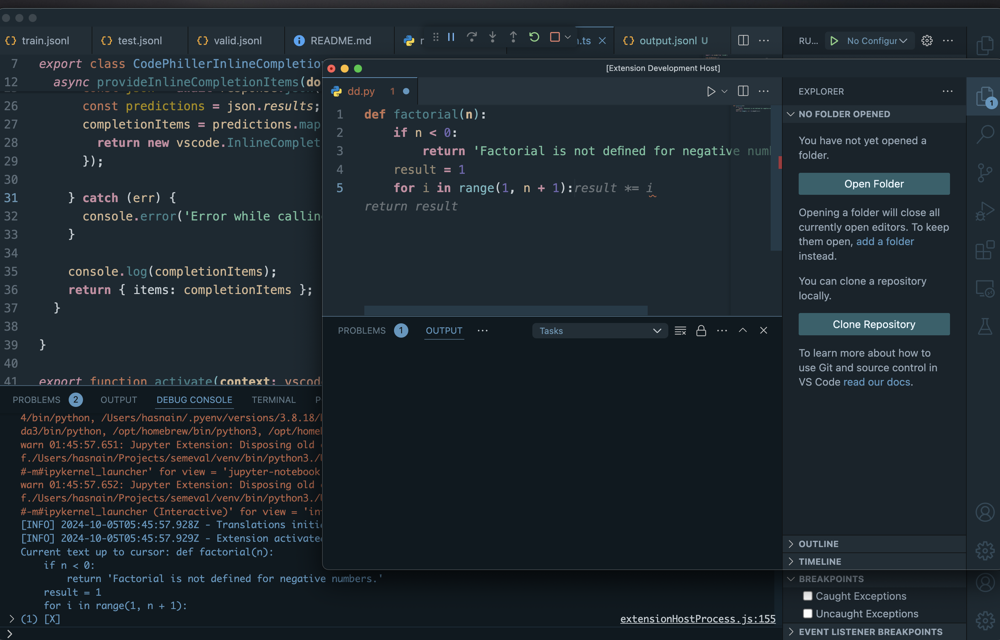

# CodePhiller: LoRA-Based Fine-Tuned Phi-3 Model for AI Inline Code Completions
CodePhiller is a basic (barely working) AI code completion tool based on a LoRA fine-tuned Phi-3 model. It provides real-time inline code suggestions as you type. Essentially a co-pilot clone but just from scratch.

Project Structure
This repository consists of several components, each responsible for a different aspect of the system:

### model-testing.ipynb -
This Jupyter notebook demonstrates how to interact with the Phi-3 model. It provides general usage including loading the model, passing in prompts, and generating completions.
Usage: Use this notebook for testing the base model's capabilities and understanding how to use it for various code autocompletion tasks.

### model-api.py
Hosts the fine-tuned model as an API endpoint. Server listens for API requests, processes code prompts, and returns inline code suggestions generated by the model.

### code-philler (VSCode Extension)
This folder contains the actual extension, CodePhiller, which integrates with the editor to provide real-time inline code suggestions.

## How It Works
Model Fine-Tuning:
The Phi-3 model has been fine-tuned using LoRA to enhance its capability in understanding code structures and generating accurate code completions.
